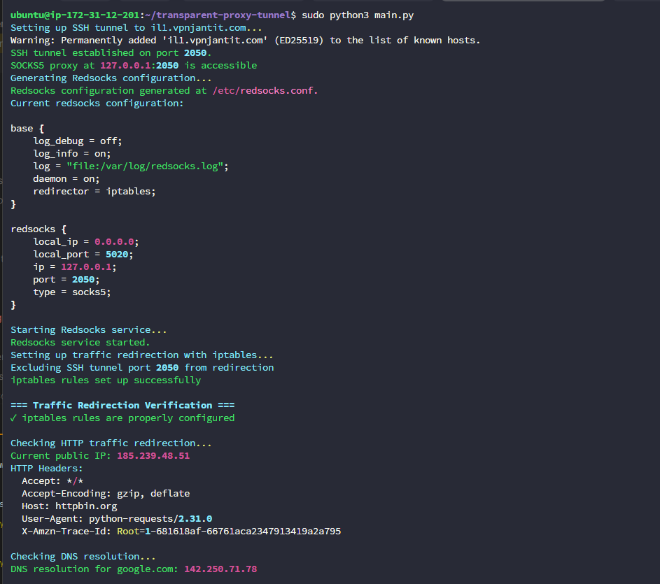

# Transparent Proxy Tool Documentation


## Overview
This transparent proxy tool allows you to redirect all TCP traffic through a SOCKS5 proxy created via an SSH tunnel. The tool supports both Windows (limited functionality with manual proxy configuration) and Linux (full transparent proxy capability using redsocks and iptables).
## Features

- Creates SSH tunnels with SOCKS5 proxy capability
- Supports both password and key-based SSH authentication
- Transparent traffic redirection (Linux only) using redsocks and iptables
- Comprehensive traffic verification to ensure proper redirection
- Detailed logging for troubleshooting

## Requirements

- Python 3.11.0 or higher
- root privileges
- SSH client installed and available in PATH
- On Linux: iptables, redsocks, and net-tools installed

## Installation

1. Clone the repository
2. Install dependencies:

```bash
pip install -r requirements.txt --break-system-packages
```

3. For Linux systems, ensure redsocks is installed (btw i'm not using arch, just saying)

```bash
# Debian/Ubuntu
sudo apt install redsocks net-tools
```

## Configuration

Create a `.env` file in the project root with the following variables:

```
REMOTE_HOST=your.ssh.server.com    # SSH server address
SSH_USER=username                  # SSH username
SSH_AUTH_METHOD=password           # Use 'password' or 'key'
SSH_AUTH_VALUE=yourpassword        # Password or path to private key
SSH_TUNNEL_PORT=2050               # Local port for SOCKS5 proxy
REDSOCKS_PORT=5020                 # Port for redsocks service
```

## Usage

### Running the Tool

```bash
sudo python main.py
```

### Verifying Proxy Operation

After starting the tool, it will:

1. Set up an SSH tunnel with SOCKS5 capability
2. Start redsocks service (Linux only)
3. Configure iptables for traffic redirection (Linux only)
4. Verify traffic redirection is working properly

The program will show:
- ✓ If iptables rules are correctly configured
- Number of packets being redirected
- Your current public IP address (should be different from your actual IP)
- Results of DNS resolution tests
- Active connections through the proxy

## Platform-Specific Information

### Linux
- Full transparent proxy capability
- All TCP traffic is automatically redirected through the proxy
- No application configuration needed

### Windows
- NOT SUPPORTED

## Understanding Redsocks Logs

Redsocks logs provide valuable information about the proxy operation. Here's how to interpret common log entries:

```
1746266222.079531 notice main.c:165 main(...) redsocks started, conn_max=128
```
- Indicates redsocks has started successfully with maximum 128 connections

```
1746266222.083519 info redsocks.c:1243 redsocks_accept_client(...) [127.0.0.1:41460->127.0.0.1:5020]: accepted
```
- Shows a client connection was accepted from 127.0.0.1:41460 to the redsocks port (5020)

```
1746266264.804697 warning redsocks.c:1437 redsocks_fini_instance(...) There are connected clients during shutdown!
```
- Warning that clients were still connected when redsocks was shutting down

```
1746266264.804869 notice redsocks.c:678 redsocks_drop_client(...) [127.0.0.1:41460->127.0.0.1:5020]: client tries to connect to the proxy using proxy!
```
- This indicates a proxy loop - the client is trying to connect to the proxy through itself

Common issues visible in logs:
- Connection loops (proxy connecting through itself)
- Connection rejections
- Authentication failures
- Timeouts when connecting to destination servers

## Troubleshooting

- Check the `main.log` file for detailed error information
- Ensure SSH server is accessible from your network
- Verify SSH credentials are correct
- Ensure `redsocks`, `iptables` and `net-tools` are properly installed
- Run verification checks to confirm traffic redirection is working properly

## Stopping the Service

Press `Ctrl+C` to gracefully stop the service. This will:
- Clean up iptables rules (Linux only)
- Stop the redsocks service (Linux only) 
- Terminate the SSH tunnel

## Security Considerations

- Running with administrator/root privileges is required
- SSH connections disable strict host key checking to prevent warnings
- Consider using key-based authentication for better security